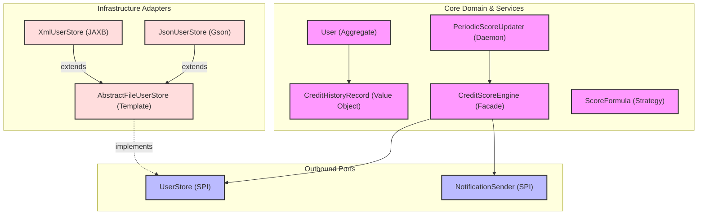

# 01. System Architecture Overview

This document outlines the high-level architecture of the **CreditScoreManagement** application. The system strictly follows the **Hexagonal Architecture** (also known as **Ports & Adapters**) pattern to decouple core business logic from infrastructure concerns.

---

## 1. Architectural Style: Ports & Adapters (Hexagonal)

The core domain contains pure Java business rules and exposes **Ports** (interfaces) for external interactions. **Adapters** in the infrastructure layer implement these ports to interact with the file system, network, or external frameworks.

---

## 2. Layered Responsibilities

### A. The Core Domain Layer
* **Responsibility**: Contains business rules, aggregate state, scoring logic, and thread-safety orchestration. Has **zero dependencies** on external frameworks.
* **Key Components**:
  - `User`: The aggregate root protecting credit history invariants. Uses **defensive copying** in its constructor to prevent reference leaking.
  - `CreditScoreEngine`: The primary orchestrator handling per-user locking and atomic read-modify-write transactions.
  - `WeightedScoreFormula`: Implements the `ScoreFormula` strategy to evaluate utilization, payment history, credit age, types, and inquiries.
  - `PeriodicScoreUpdater`: A background daemon executing scheduled batch evaluations.

### B. The Ports Layer
* **Responsibility**: Defines the system boundary via abstractions.
* **Key Components**:
  - `UserStore`: Contract for fetching, saving, and querying user profiles.
  - `NotificationSender`: Contract for asynchronous user alerting.

### C. The Infrastructure Layer
* **Responsibility**: Provides concrete adapters for physical storage and configuration.
* **Key Components**:
  - `XmlUserStore` & `JsonUserStore`: Concrete persistence engines. Both implement **atomic temp-and-swap** file writing to prevent data corruption.
  - `PersistenceRegistry`: A factory mapping configured settings to the correct adapter.

---

## 3. Concurrency & State Management

A cornerstone of the application is its rigorous thread-safety strategy, ensuring data integrity during high-throughput operations.

### A. Per-User Locking (`ReentrantLock`)
The `CreditScoreEngine` enforces strict atomicity using a `ConcurrentHashMap<String, ReentrantLock>`. Every state-mutating operation (e.g., adding a transaction via `addTransactionToUser`) follows a guaranteed atomic read-modify-write workflow:
1. Acquire the exclusive `ReentrantLock` for the user's SSN.
2. Fetch a fresh copy of the user from the `UserStore`.
3. Mutate the aggregate, recalculate the score, and persist back to the store.
4. Release the lock.

This guarantees that concurrent operations on the *same* user are serialized safely, while operations on *different* users execute fully in parallel.

### B. Cache Boundary Immutability (Defensive Copies)
To prevent reference-leaking and accidental state mutation outside the locking bounds, the persistence cache strictly enforces immutability at its boundary.
- When `AbstractFileUserStore.findBySsn()` or `findAll()` is called, it returns a **defensive deep copy** of the cached aggregate.
- Modifying a returned `User` object has zero effect on the internal cache until it is explicitly passed back into `save()`.

### C. Background Processing (`PeriodicScoreUpdater`)
Batch calculations run on a dedicated single-threaded `ScheduledExecutorService` daemon thread managed by `PeriodicScoreUpdater`.
To safely interact with live user traffic, the updater fetches a defensive snapshot of all known SSNs and iterates through them. For each SSN, it acquires the individual `ReentrantLock`, fetches the freshest state, evaluates it, and unlocks—ensuring the batch job perfectly respects the atomic per-user locking constraints.
