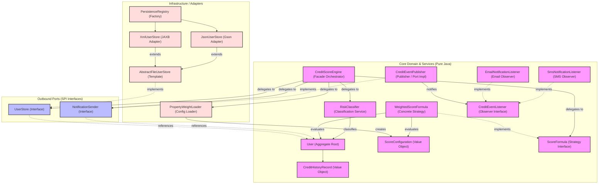
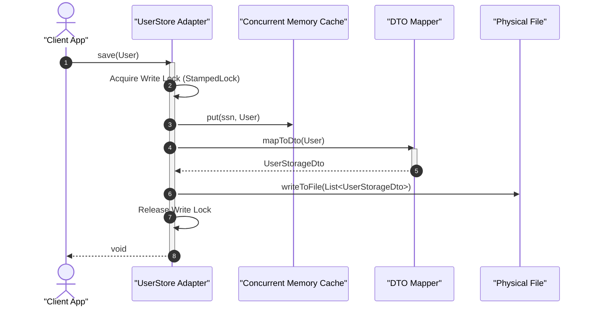

# 01. System Architecture Overview

This document outlines the high-level architecture of the **CreditScoreManagement** application. The system is designed using the **Hexagonal Architecture** (also known as **Ports & Adapters**) pattern, ensuring strict separation of concerns, complete decoupling of core business rules from external infrastructure details, and high testability.

---

## 1. Architectural Style: Ports & Adapters (Hexagonal)

The primary goal of Ports & Adapters is to create a clean boundary between the application's core logic and external concerns (databases, user interfaces, serialization frameworks, message queues). 

---

## 2. Layered Responsibilities

The codebase is organized into three distinct layers, each with explicit dependencies pointing inwards towards the core business domain.

### A. The Core Domain & Service Layer (`com.montran.creditscore.domain` & `com.montran.creditscore.service`)
* **Responsibility**: Houses all business rules, invariants, definitions, domain state, scoring algorithms, and event notifications.
* **Key Components**:
  - `User`: Domain Aggregate Root representing a client profile, managing name, address, email, credit limit, credit score, and risk status.
  - `CreditHistoryRecord`: Value Object representing an immutable log of a financial transaction with original due dates and settlement dates.
  - `ScoreConfiguration`: Value Object encapsulating custom mathematical weights and grace periods applied during score evaluations.
  - `ScoreFormula`: Strategy interface defining the contract for credit scoring calculation algorithms.
  - `WeightedScoreFormula`: Concrete Strategy implementation executing the standardized scoring algorithms (utilization, payment history, age, type variance, recent inquiries).
  - `RiskClassifier`: Domain Utility Service classifying calculated scores into risk profiles (`LOW`, `MEDIUM`, `HIGH`).
  - `CreditEventListener`: Observer interface defining the receipt contract for profile alerts.
  - `EmailNotificationListener` & `SmsNotificationListener`: Concrete Observer implementations simulating network-based email and SMS delivery gateways.
  - `CreditEventPublisher`: Subject component acting as the concrete implementation of the outbound port `NotificationSender`, distributing alerts asynchronously to registered observers.
  - [CreditScoreEngine](file:///c:/Users/jcando/projects/Simulacro/CreditScoreManagement/src/main/java/com/montran/creditscore/service/CreditScoreEngine.java): Facade orchestrator offering a unified interface to register profiles, append transaction logs, evaluate scores, classify risks, and trigger notifications asynchronously.
  - `RiskLevel`, `TransactionStatus`, `TransactionType`: Domain-specific enumerations defining state bounds.
* **Inward Dependency Constraint**: This layer has **zero dependencies** on external frameworks (e.g., JAXB, Gson), file systems, or networking libraries. It is built using pure Java standard library features.

### B. The Ports Layer (`com.montran.creditscore.domain.port`)
* **Responsibility**: Defines boundary abstractions (contracts) for communication between the domain and the outside world.
* **Key Components**:
  - `UserStore`: Outbound Port (SPI) declaring persistence actions (`save`, `findBySsn`, `findAll`, `deleteBySsn`).
  - `NotificationSender`: Outbound Port declaring messaging actions (`sendNotification`).
* **Inward Dependency Constraint**: Interface definitions only refer to core domain types.

### C. The Infrastructure Layer (`com.montran.creditscore.infrastructure`)
* **Responsibility**: Provides concrete adapters implementing the Port interfaces, handling actual interactions with disk files, formats, frameworks, and third-party libraries.
* **Key Components**:
  - `XmlUserStore`: A concrete persistence adapter that marshals and unmarshals XML documents using the **JAXB** architecture.
  - `JsonUserStore`: A concrete persistence adapter that handles serialized JSON document operations using the **Google Gson** library.
  - `dto/` Package: Flat Data Transfer Objects (`UserStorageDto`, `SystemContainerDto`, `CreditHistoryStorageDto`) decorated with serialization metadata. These prevent infrastructure requirements (such as zero-argument constructors or JAXB annotations) from polluting the domain models.
  - `PersistenceRegistry`: A registry facilitating the runtime selection of the storage adapter based on configuration parameters.
  - `PropertyWeightLoader`: Configuration component responsible for loading mathematical parameters and default weights dynamically from classpath files.

---

## 3. Technology Stack

* **Language**: Java 8 (source/target compatibility `1.8`)
* **Build System**: Gradle
* **Serialization Libraries**:
  - **JAXB** (`javax.xml.bind`): For XML file structure marshalling.
  - **Google Gson (v2.10.1)**: For JSON structure serialization.
* **Testing Framework**: JUnit 5 (JUnit Jupiter)
* **Concurrency Primitives**: `java.util.concurrent` (specifically `StampedLock`, `ConcurrentHashMap`)

---

## 4. Key Data & Control Flows

### Save/Write Scenario
1. The client code invokes `save(User)` on the configured adapter.
2. The adapter acquires a **Write Lock** (`StampedLock`).
3. The domain aggregate `User` is mapped to its DTO representation (`UserStorageDto`).
4. The DTO list is passed to the concrete implementation of `writeToFile(List<UserStorageDto>)`.
5. The list is serialized to the physical file system (either JSON or XML format).
6. The Write Lock is unlocked.

---

## 5. Architectural Benefits

1. **Independent Adaptability**: The XML persistence adapter can be swapped out for a JSON persistence adapter or a SQL database driver without altering a single line of code in the core business rules.
2. **Decoupled Data Shapes**: Core domain entities preserve immutable collections, custom constructors, and business invariant validations. The DTOs preserve mutable properties, default constructors, and serialization annotations, keeping both concerns completely separate.
3. **High Testability**: Since the business rules depend entirely on interfaces (ports), unit tests can easily mock out the adapters, allowing fast, isolated, and reliable test suites.
