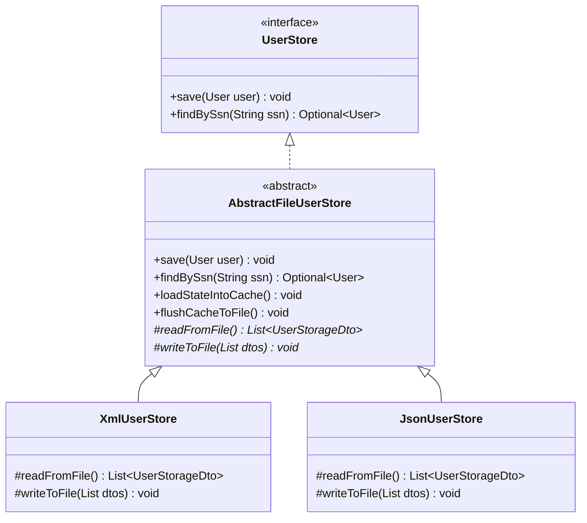
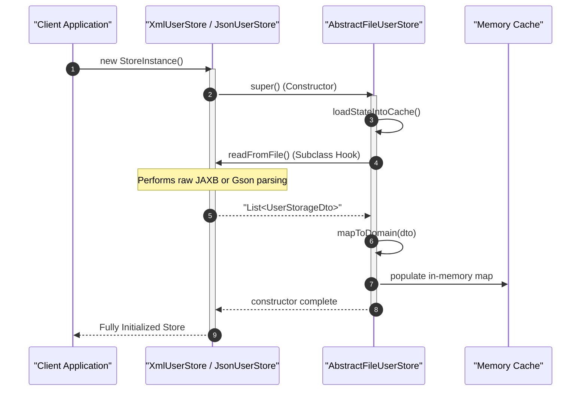
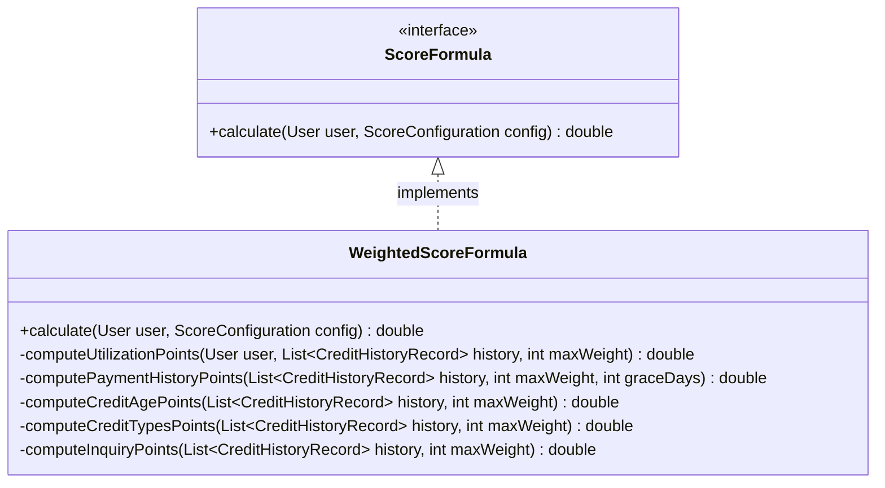
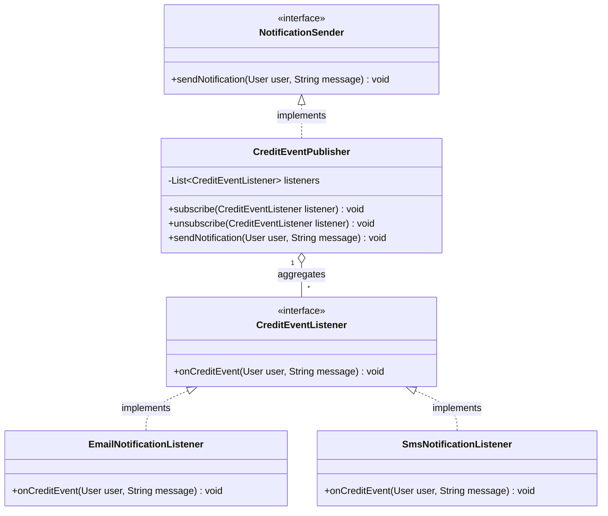

# 02. Behavioral Design Patterns

This document describes the behavioral design patterns implemented in the **CreditScoreManagement** system. These patterns govern how responsibilities, control flows, and communications are managed between objects.

---

## 1. Template Method Pattern

### Description & Intent
The Template Method pattern defines the skeleton of an algorithm in a method, deferring some steps to subclasses. This allows subclasses to redefine certain steps of an algorithm without changing the algorithm's overall structure.

In this system, **`AbstractFileUserStore`** establishes the template for managing file-based user transactions, caching, concurrent thread locks, and mapping procedures. It delegates physical disk writing and reading tasks to concrete implementation subclasses.



---

## 2. Behavioral Workflow Mapping

### Algorithm Template: `save(User)`
The process of saving a user profile follows a precise, non-overridable execution template inside `AbstractFileUserStore`:

1. **Locking**: Acquire write lock (`StampedLock.writeLock()`).
2. **Cache Insertion**: Place the domain aggregate root into the thread-safe concurrent HashMap (`cache.put()`).
3. **Synchronization (Flush)**: Translate cache items to DTO lists and invoke the template hook `writeToFile(dtos)`.
4. **Unlocking**: Ensure the write lock is released in a `finally` block.

```java
    public void save(User user) {
        long stamp = lock.writeLock();
        try {
            cache.put(user.getSsn(), user);
            flushCacheToFile();
        } finally {
            lock.unlockWrite(stamp);
        }
    }

    private void flushCacheToFile(){
        List<UserStorageDto> dtos = cache.values().stream()
                .map(this::mapToDto)
                .collect(Collectors.toList());
        writeToFile(dtos); // Subclass Hook Method
    }
```

Subclasses must implement the hooks:
- **`XmlUserStore`** implements `writeToFile(dtos)` by marshalling the container using `Marshaller.marshal()`.
- **`JsonUserStore`** implements `writeToFile(dtos)` by converting the container using `GSON.toJson()`.

---

## 3. Behavioral Lifecycle: Cache Loading on Startup

When any File User Store is initialized, its constructor calls `loadStateIntoCache()`, which relies on the abstract template method `readFromFile()` to bootstrap the cache:



## 4. Strategy Design Pattern

### Description & Intent
The Strategy Pattern defines a family of algorithms, encapsulates each one, and makes them interchangeable. It allows the algorithm to vary independently from the clients that use it.

In **CreditScoreManagement**, the credit scoring calculations are encapsulated behind the [ScoreFormula](file:///c:/Users/jcando/projects/Simulacro/CreditScoreManagement/src/main/java/com/montran/creditscore/service/calculation/ScoreFormula.java) strategy interface. This isolates complex scoring rules and math from the core orchestrator or persistence adapters, allowing new scoring models (e.g., FICO, custom localized models) to be plugged in dynamically.

### Architectural Structure



### Core Implementation
The concrete implementation, [WeightedScoreFormula](file:///c:/Users/jcando/projects/Simulacro/CreditScoreManagement/src/main/java/com/montran/creditscore/service/calculation/WeightedScoreFormula.java), calculates a rating by summing up five distinct weighted categories:

1. **Credit Utilization Ratio**: Evaluates used credit against the personal `totalCreditLimit`.
2. **Payment History**: Computes payment punctuality, taking into account `latePaymentGraceDays` limit parameters.
3. **Credit Age**: Evaluates the average lifespan of active credit accounts.
4. **Credit Types**: Evaluates variety in the types of financial accounts.
5. **Inquiries**: Penalizes hard inquiries made in the last 24 months.

---

## 5. Observer Design Pattern

### Description & Intent
The Observer Pattern defines a one-to-many dependency between objects so that when one object changes state, all its dependents are notified and updated automatically.

In this system, the **Observer Pattern** is implemented to broadcast profile updates to multiple, decoupled alert channels (such as Email or SMS).
- **Subject Interface**: [NotificationSender](file:///c:/Users/jcando/projects/Simulacro/CreditScoreManagement/src/main/java/com/montran/creditscore/domain/port/outbound/NotificationSender.java) declares the notification trigger.
- **Subject Concrete**: [CreditEventPublisher](file:///c:/Users/jcando/projects/Simulacro/CreditScoreManagement/src/main/java/com/montran/creditscore/service/notification/CreditEventPublisher.java) implements `NotificationSender`. It manages the list of observers and notifies them when an event occurs.
- **Observer Interface**: [CreditEventListener](file:///c:/Users/jcando/projects/Simulacro/CreditScoreManagement/src/main/java/com/montran/creditscore/service/notification/CreditEventListener.java) defines the notification callback contract.
- **Concrete Observers**: [EmailNotificationListener](file:///c:/Users/jcando/projects/Simulacro/CreditScoreManagement/src/main/java/com/montran/creditscore/service/notification/EmailNotificationListener.java) and [SmsNotificationListener](file:///c:/Users/jcando/projects/Simulacro/CreditScoreManagement/src/main/java/com/montran/creditscore/service/notification/SmsNotificationListener.java) simulate specific network delivery mechanisms.

### Architectural Structure



### Key Technical Enhancements

1. **Thread-Safe Observer Collection (`CopyOnWriteArrayList`)**:
   Since the subscriber list can be modified (subscribing or unsubscribing) concurrently by administrative or user threads while the system is iterating over it to send notifications, the publisher stores observers in a `CopyOnWriteArrayList`. This collection creates a fresh clone of the underlying array during write modifications, allowing safe, lock-free concurrent reads and preventing `ConcurrentModificationException` during event broadcasting.

2. **Asynchronous Broadcasts (`CompletableFuture.runAsync()`)**:
   Standard observer loops execute sequentially on the calling thread, meaning a slow external gateway (such as a network-blocked SMTP server or a third-party SMS API) would block the main execution flow. 
   To prevent this, `CreditEventPublisher` dispatches each notification asynchronously on separate thread-pool threads:
   ```java
   for (CreditEventListener listener : listeners) {
       CompletableFuture.runAsync(() -> listener.onCreditEvent(user, message))
               .exceptionally(ex -> {
                   System.err.println("Critical failure dispatching notification: " + ex.getMessage());
                   return null;
               });
   }
   ```

---

## 6. Key Benefits of Behavioral Designs

1. **Code Reuse (Template Method)**: Concurrency locking (using StampedLock), mapping, and caching structures are defined once in [AbstractFileUserStore](file:///c:/Users/jcando/projects/Simulacro/CreditScoreManagement/src/main/java/com/montran/creditscore/infrastructure/persistence/AbstractFileUserStore.java), preventing duplication across XML and JSON stores.
2. **Algorithm Interchangeability (Strategy)**: New scoring formulas can be added by implementing [ScoreFormula](file:///c:/Users/jcando/projects/Simulacro/CreditScoreManagement/src/main/java/com/montran/creditscore/service/calculation/ScoreFormula.java) and configuring the runtime context to use the new implementation, satisfying the Open/Closed Principle.
3. **Decoupled Communications (Observer)**: Delivery endpoints (SMS, Email, Push Notifications) are kept isolated from calculations, allowing observers to be added, removed, or modified dynamically at runtime without affecting calculation flows.
