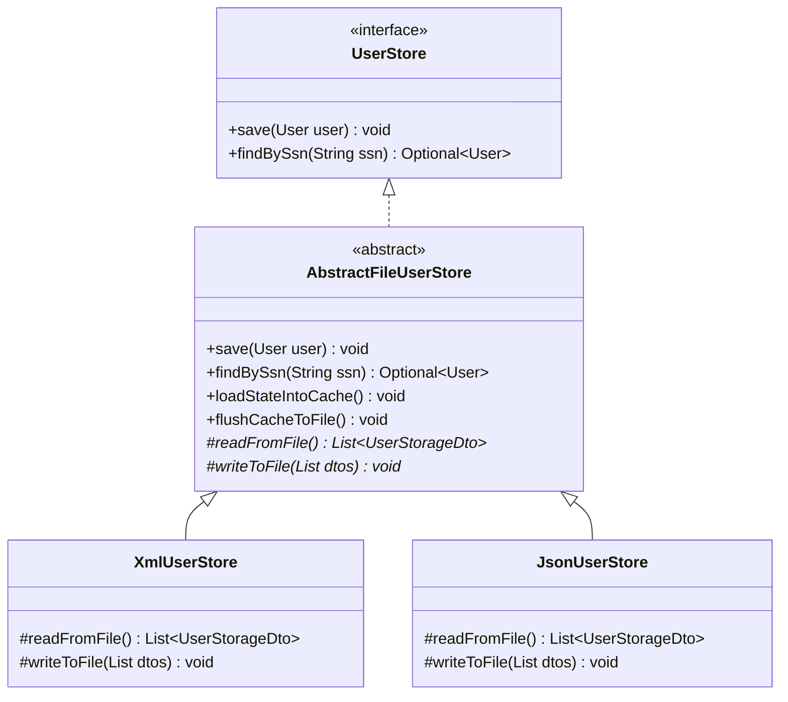

# 02. Behavioral Design Patterns

This document describes the behavioral design patterns implemented in the **CreditScoreManagement** system. These patterns govern how responsibilities, control flows, and communications are managed between objects.

---

## 1. Template Method Pattern

### Description & Intent
The Template Method pattern defines the skeleton of an algorithm in a method, deferring some steps to subclasses. This allows subclasses to redefine certain steps of an algorithm without changing the algorithm's overall structure.

In this system, **`AbstractFileUserStore`** establishes the template for managing file-based user transactions, caching, concurrent thread locks, and mapping procedures. It delegates physical disk writing and reading tasks to concrete implementation subclasses.



---

## 2. Behavioral Workflow Mapping

### Algorithm Template: `save(User)`
The process of saving a user profile follows a precise, non-overridable execution template inside `AbstractFileUserStore`:

1. **Locking**: Acquire write lock (`StampedLock.writeLock()`).
2. **Cache Insertion**: Place the domain aggregate root into the thread-safe concurrent HashMap (`cache.put()`).
3. **Synchronization (Flush)**: Translate cache items to DTO lists and invoke the template hook `writeToFile(dtos)`.
4. **Unlocking**: Ensure the write lock is released in a `finally` block.

```java
    public void save(User user) {
        long stamp = lock.writeLock();
        try {
            cache.put(user.getSsn(), user);
            flushCacheToFile();
        } finally {
            lock.unlockWrite(stamp);
        }
    }

    private void flushCacheToFile(){
        List<UserStorageDto> dtos = cache.values().stream()
                .map(this::mapToDto)
                .collect(Collectors.toList());
        writeToFile(dtos); // Subclass Hook Method
    }
```

Subclasses must implement the hooks:
- **`XmlUserStore`** implements `writeToFile(dtos)` by marshalling the container using `Marshaller.marshal()`.
- **`JsonUserStore`** implements `writeToFile(dtos)` by converting the container using `GSON.toJson()`.

---

## 3. Behavioral Lifecycle: Cache Loading on Startup

When any File User Store is initialized, its constructor calls `loadStateIntoCache()`, which relies on the abstract template method `readFromFile()` to bootstrap the cache:


---

## 4. Key Benefits

1. **Code Reuse**: Concurrency locking (using `StampedLock`), mapping (`mapToDto`/`mapToDomain`), and caching structures are defined once in the abstract class, preventing code duplication across JSON and XML stores.
2. **Strict Structure**: Subclasses are forced to implement only file serialization logic, ensuring thread safety and data mapping rules remain consistent across all adapters.
