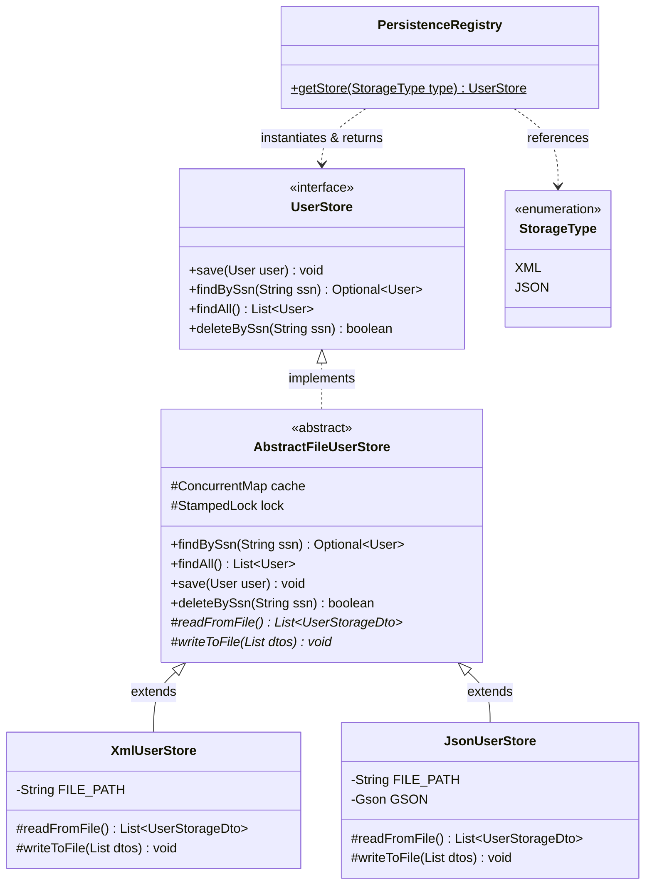

# 02. Creational Design Patterns

This document details the creational design patterns implemented in the **CreditScoreManagement** system. These patterns isolate class instantiation logic, ensuring the client application is decoupled from concrete configurations and dependencies.

---

## 1. Simple Factory Pattern / Factory Method

### Description & Intent
The system uses a centralized creational abstraction, **`PersistenceRegistry`**, to instantiate and supply the appropriate outbound persistence adapter at runtime based on the requested configuration. This prevents client code from directly instantiating the concrete classes (`XmlUserStore` or `JsonUserStore`) and couples them only to the `UserStore` interface (an Outbound Port in Hexagonal terms).

### Architectural Structure

The structure of the Factory configuration is shown below:



---

## 2. Code Implementation Detail

### A. Factory Configuration Parameter: `StorageType`
An enumeration representing the choices of persistence format:
```java
package com.montran.creditscore.infrastructure.persistence;

public enum StorageType {
    XML,
    JSON
}
```

### B. Factory Class: `PersistenceRegistry`
The registry ensures strict initialization:
1. Direct instantiation is blocked by a `private` constructor throwing `UnsupportedOperationException`.
2. A static factory method `getStore(StorageType)` processes options using a switch-case tree.
3. Checks for `null` parameters are enforced to avoid runtime failures.

```java
package com.montran.creditscore.infrastructure.persistence;

import com.montran.creditscore.domain.port.outbound.UserStore;

public final class PersistenceRegistry {

    private PersistenceRegistry() {
        throw new UnsupportedOperationException("Utility factory class cannot be instantiated.");
    }

    public static UserStore getStore(StorageType type) {
        if (type == null) {
            throw new IllegalArgumentException("Storage type configuration cannot be null.");
        }
        switch (type) {
            case XML:
                return new XmlUserStore();
            case JSON:
                return new JsonUserStore();
            default:
                throw new IllegalArgumentException("Unsupported storage framework requested: " + type);
        }
    }
}
```

---

## 3. Benefits & Trade-offs

### Benefits:
1. **Low Coupling**: The client application does not import `XmlUserStore` or `JsonUserStore`. It only needs to know about `UserStore` and `StorageType`.
2. **Encapsulated Initialization**: Any complexity related to file setups, parsing configurations, or serialization caches is hidden behind the factory method.
3. **Single Point of Configuration**: Adding a new persistence format (e.g., SQL database or memory-based store) only requires updating this factory and adding a new enum value.

### Trade-offs:
* **Switch Violation of Open/Closed Principle (OCP)**: Adding a new storage type requires modifying the switch block inside `PersistenceRegistry`. However, for a small system, this is highly manageable and self-contained.
