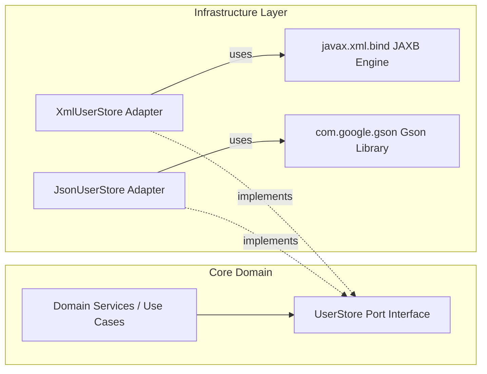
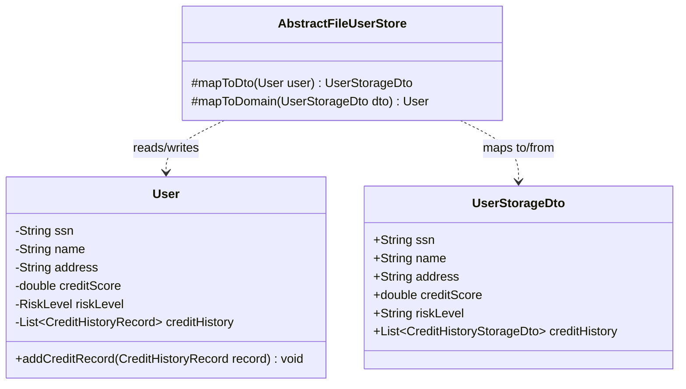
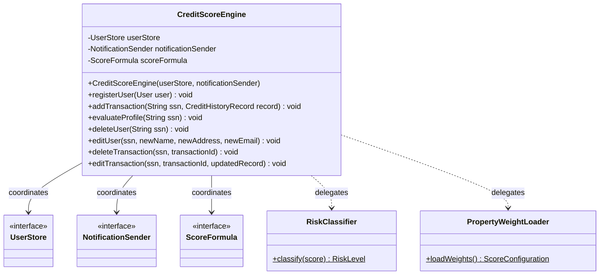

# 02. Structural Design Patterns

This document describes the structural design patterns implemented in the **CreditScoreManagement** system. These patterns govern how classes and interfaces compose to form larger, flexible systems.

---

## 1. Adapter Pattern (Ports & Adapters)

### Description & Intent
The Adapter pattern allows incompatible interfaces to work together. In Hexagonal terms, the ports are the interfaces expected by the core domain, and the adapters are the concrete wrappers translation layers connecting the system to the outside infrastructure.

Here, **`XmlUserStore`** and **`JsonUserStore`** adapt physical file operations (using external libraries JAXB and Gson) to conform to the **`UserStore`** interface required by the core logic.



### Adaptation Details:
- **XML Adapter (`XmlUserStore`)**: Converts raw XML records in `users.xml` to `User` domain entity structures. It delegates serialization parsing to JAXB marshalling utilities.
- **JSON Adapter (`JsonUserStore`)**: Converts raw JSON text records in `users.json` to `User` domain entity structures. It delegates parsing to the Google Gson serialization engine.

---

## 2. Data Transfer Object (DTO) Pattern

### Description & Intent
To prevent serialization annotations, reflection constraints, and database-specific requirements from polluting the core Domain layer, the system uses the **Data Transfer Object (DTO)** pattern.

The domain entity `User` contains complex invariant checking, thread-safe synchronization locks, and private immutable list collections. In contrast, the DTO classes are lightweight, public, and mutable.

### Structural Mapping Table

| Domain Layer (Encapsulated & Immutable) | DTO Layer (Flattened & Mutable) | Purpose |
|---|---|---|
| `com.montran.creditscore.domain.model.User` | `com.montran.creditscore.infrastructure.persistence.dto.UserStorageDto` | Encapsulates client details vs. flat, serializable XML/JSON block. |
| `com.montran.creditscore.domain.model.CreditHistoryRecord` | `com.montran.creditscore.infrastructure.persistence.dto.CreditHistoryStorageDto` | Immutable transaction record vs. mutable serializable data node. |
| (None: Handled implicitly in collection) | `com.montran.creditscore.infrastructure.persistence.dto.SystemContainerDto` | Structural wrapper representing the root file element (`<creditSystem>`). |

### DTO Structural Interaction:
The class mapping flows between Domain entities and DTO schemas during database operations:



---

## 3. Concurrency Structural Pattern (Locking & Caching)

The abstract adapter structure incorporates concurrency control directly within the store boundary, combining caching with reader-writer isolation:

1. **Memory Caching (`ConcurrentHashMap`)**: Implemented at `AbstractFileUserStore.cache` to reduce disk reads.
2. **Optimistic Concurrency Locking (`StampedLock`)**: Enforces high-performance thread safety. Instead of heavy synchronized blocks, it performs optimistic reads that validate whether a write occurred during execution. If a validation fails, it falls back to a pessimistic read lock, minimizing blocking in read-heavy applications.

```java
    @Override
    public Optional<User> findBySsn(String ssn) {
        long stamp = lock.tryOptimisticRead();
        User user = cache.get(ssn);
        // If a write occurred during our optimistic read, fall back to a strict read lock.
        if(!lock.validate(stamp)){
            stamp = lock.readLock();
            try {
                user = cache.get(ssn);
            } finally {
                lock.unlockRead(stamp);
            }
        }
        return Optional.ofNullable(user);
    }
```

---

## 4. Facade Design Pattern

### Description & Intent
The Facade Pattern provides a unified, simplified interface to a set of interfaces in a subsystem. Facade defines a higher-level interface that makes the subsystem easier to use.

In **CreditScoreManagement**, **[CreditScoreEngine](file:///c:/Users/jcando/projects/Simulacro/CreditScoreManagement/src/main/java/com/montran/creditscore/service/CreditScoreEngine.java)** acts as a Facade. Instead of forcing the client application to coordinate the database loading (`UserStore`), mathematical configurations loading (`PropertyWeightLoader`), credit calculations (`ScoreFormula`), risk categorization (`RiskClassifier`), saving the updated models, and sending notifications (`NotificationSender`), the client interacts exclusively with `CreditScoreEngine`.

### Architectural Structure



### Core Orchestration Workflow: `evaluateProfile(String ssn)`
The facade orchestrates the following operations under a single method call:
1. **Retrieve**: Obtains the `User` aggregate from [UserStore](file:///c:/Users/jcando/projects/Simulacro/CreditScoreManagement/src/main/java/com/montran/creditscore/domain/port/outbound/UserStore.java).
2. **Configure**: Loads dynamic parameters from [PropertyWeightLoader](file:///c:/Users/jcando/projects/Simulacro/CreditScoreManagement/src/main/java/com/montran/creditscore/infrastructure/config/PropertyWeightLoader.java).
3. **Calculate**: Evaluates score via [ScoreFormula](file:///c:/Users/jcando/projects/Simulacro/CreditScoreManagement/src/main/java/com/montran/creditscore/service/calculation/ScoreFormula.java).
4. **Classify**: Resolves risk levels via [RiskClassifier](file:///c:/Users/jcando/projects/Simulacro/CreditScoreManagement/src/main/java/com/montran/creditscore/service/risk/RiskClassifier.java).
5. **Persist**: Commits changes back to the database.
6. **Notify**: Triggers asynchronous alerts via [NotificationSender](file:///c:/Users/jcando/projects/Simulacro/CreditScoreManagement/src/main/java/com/montran/creditscore/domain/port/outbound/NotificationSender.java) if states shift.

### Auxiliary Orchestration Workflows

1. **Profile Editing (`editUser`)**:
   Locates the user by SSN, invokes aggregate profile mutation `user.updateProfile(newName, newAddress, newEmail)` to safely validate and set fields, then saves state back to [UserStore](file:///c:/Users/jcando/projects/Simulacro/CreditScoreManagement/src/main/java/com/montran/creditscore/domain/port/outbound/UserStore.java).
2. **Transaction Deletion (`deleteTransaction`)**:
   Locates the user by SSN, delegates deletion to `user.removeCreditRecord(transactionId)`, and saves if successfully removed.
3. **Transaction Modification (`editTransaction`)**:
   Locates the user by SSN, delegates substitution to `user.updateCreditRecord(transactionId, updatedRecord)`, and saves if successfully updated.

