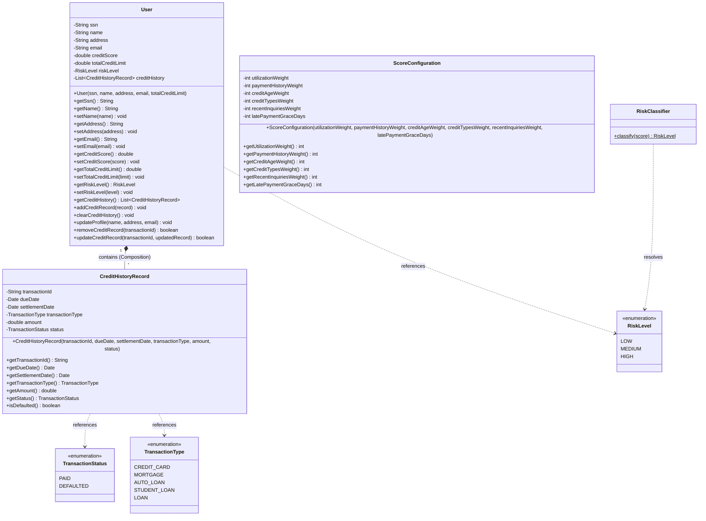

# 03. Domain Model and Boundaries

This document details the core Domain Model of the **CreditScoreManagement** application, focusing on the concepts, structural relationships, business invariants, and thread-safety policies implemented.

---

## 1. Domain Class Diagram (UML Representation)

Below is the UML mapping of the Core Domain classes and enums. It highlights the boundary of the **User Aggregate Root** and the relationship with its immutable components.



---

## 2. Tactical Domain Concepts

### A. Aggregate Root: `User`
The `User` class acts as the **Aggregate Root** of its domain boundary.
* **Identity**: Uniquely identified by a Social Security Number (`ssn`), which acts as the primary logical business key.
* **Encapsulation**: State transitions and calculations are managed within the aggregate boundary. Internal collections cannot be directly modified by external classes.
* **Invariants enforced**:
  - The SSN must be non-null and non-blank during construction.
  - The total credit limit must be strictly greater than zero.
  - Adding records requires a non-null `CreditHistoryRecord` instance.
  - Modifying user credentials (name, address, email) is restricted to profile updates.
  - Mutating transaction ledgers (deleting or editing logs) is managed strictly by identifying entries via a unique `transactionId`.

### B. Value Object: `CreditHistoryRecord`
An immutable value object representing a financial transaction log.
* **Identity**: Uniquely designated within the user profile boundary by a logical `transactionId` (automatically generated as a UUID if omitted).
* **Equality**: Defined entirely by the values of its attributes (`transactionId`, `dueDate`, `settlementDate`, `transactionType`, `amount`, `status`) rather than a database primary key.
* **Immutability**: Designed to be thread-safe and read-only. Once instantiated, its properties cannot be changed.

### C. Value Object: `ScoreConfiguration`
An immutable value object representing mathematical configurations used to calculate user credit scores.
* **Equality**: Defined by the combination of its weights (`utilizationWeight`, `paymentHistoryWeight`, `creditAgeWeight`, `creditTypesWeight`, `recentInquiriesWeight`) and its `latePaymentGraceDays`.
* **Immutability**: Enforces a strictly read-only design with private final fields and no setters, making it safe to share across concurrent calculation tasks.

### D. Domain Utility Service: `RiskClassifier`
A static utility service executing business range mapping.
* **Responsibility**: Classifies calculated credit scores into risk levels:
  - Score >= 75.0: `RiskLevel.LOW`
  - 50.0 <= Score < 75.0: `RiskLevel.MEDIUM`
  - Score < 50.0: `RiskLevel.HIGH`

---

## 3. Thread-Safety and Immutability Design Justifications

Sharing mutable state across concurrent execution threads can introduce race conditions and state corruption. The domain model addresses this through two techniques:

### A. Collection Defensive Copies & Unmodifiable Lists
Inside the `User` aggregate root, `creditHistory` is stored in a mutable `ArrayList`. However, exposing this list directly via a getter would allow external classes to bypass the aggregate boundary:

```java
// Bad: Allows external modification (e.g. user.getCreditHistory().clear())
public List<CreditHistoryRecord> getCreditHistory() {
    return this.creditHistory; 
}
```

Instead, the class returns an **unmodifiable view wrapper**:
```java
// Good: Encapsulates the collection state safely
public List<CreditHistoryRecord> getCreditHistory() {
    return Collections.unmodifiableList(this.creditHistory);
}
```
Any attempt to invoke mutators (such as `add()`, `remove()`, or `clear()`) on this list will throw an `UnsupportedOperationException`.

### B. Defensive Copying of Mutable Date Objects
The `java.util.Date` class is mutable. If `CreditHistoryRecord` kept a reference to the `Date` passed to its constructor, external code could alter the date after construction. Similarly, returning the original `Date` reference in a getter would expose it to external modifications.

To prevent this, `CreditHistoryRecord` performs **defensive copying** at both construction and retrieval:

#### Construction Defensive Copying:
```java
// Clone dates at creation to prevent external modifications
this.dueDate = new Date(dueDate.getTime());
this.settlementDate = (settlementDate != null) ? new Date(settlementDate.getTime()) : null;
```

#### Getter Defensive Copying:
```java
public Date getDueDate() {
    return new Date(this.dueDate.getTime());
}

public Date getSettlementDate() {
    return (this.settlementDate != null) ? new Date(this.settlementDate.getTime()) : null;
}
```

---

## 4. Domain Invariant Validations

Both classes enforce strict business invariants during instantiation:

### `User` Validations:
```java
public User(String ssn, String name, String address, String email, double totalCreditLimit) {
    if (ssn == null || ssn.trim().isEmpty()) {
        throw new IllegalArgumentException("A unique, non-blank SSN identifier is mandatory.");
    }
    if (totalCreditLimit <= 0) {
        throw new IllegalArgumentException("Total credit limit must be greater than zero.");
    }
    this.ssn = ssn;
    this.name = name;
    this.address = address;
    this.email = email;
    this.creditScore = 0.0;
    this.riskLevel = RiskLevel.HIGH;
    this.creditHistory = new ArrayList<>();
    this.totalCreditLimit = totalCreditLimit;
}
```

### `CreditHistoryRecord` Validations:
```java
public CreditHistoryRecord(String transactionId, Date dueDate, Date settlementDate, TransactionType transactionType, double amount, TransactionStatus status) {
    if (dueDate == null) {
        throw new IllegalArgumentException("Transaction due date cannot be null.");
    }
    if (transactionType == null) {
        throw new IllegalArgumentException("Transaction context type cannot be null.");
    }
    if (status == null) {
        throw new IllegalArgumentException("Transaction settlement status cannot be null.");
    }
    if (amount < 0.0) {
        throw new IllegalArgumentException("Historical financial transaction amount cannot be negative.");
    }
    this.transactionId = (transactionId != null && !transactionId.trim().isEmpty()) ? transactionId : UUID.randomUUID().toString();
    this.dueDate = new Date(dueDate.getTime());
    this.settlementDate = (settlementDate != null) ? new Date(settlementDate.getTime()) : null;
    this.transactionType = transactionType;
    this.amount = amount;
    this.status = status;
}
```
These guard clauses ensure that invalid domain objects cannot be created.
