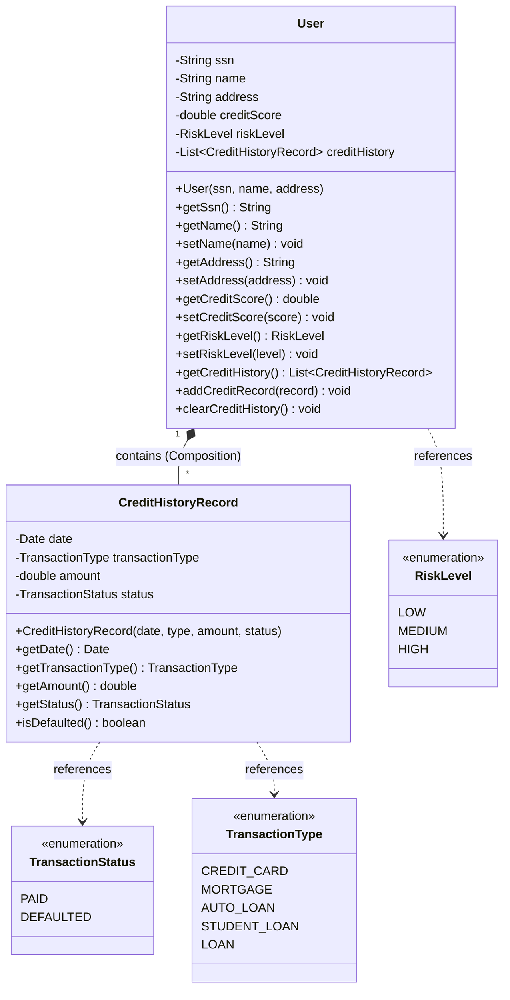

# 03. Domain Model and Boundaries

This document details the core Domain Model of the **CreditScoreManagement** application, focusing on the concepts, structural relationships, business invariants, and thread-safety policies implemented.

---

## 1. Domain Class Diagram (UML Representation)

Below is the UML mapping of the Core Domain classes and enums. It highlights the boundary of the **User Aggregate Root** and the relationship with its immutable components.



---

## 2. Tactical Domain Concepts

### A. Aggregate Root: `User`
The `User` class acts as the **Aggregate Root** of its domain boundary.
* **Identity**: Uniquely identified by a Social Security Number (`ssn`), which acts as the primary logical business key.
* **Encapsulation**: State transitions and calculations are managed within the aggregate boundary. Internal collections cannot be directly modified by external classes.
* **Invariants enforced**:
  - The SSN must be non-null and non-blank during construction.
  - Adding records requires a non-null `CreditHistoryRecord` instance.

### B. Value Object: `CreditHistoryRecord`
An immutable value object representing a financial transaction log.
* **Equality**: Defined entirely by the values of its attributes (`date`, `transactionType`, `amount`, `status`) rather than a database ID.
* **Immutability**: Designed to be thread-safe and read-only. Once instantiated, its properties cannot be changed.

---

## 3. Thread-Safety and Immutability Design Justifications

Sharing mutable state across concurrent execution threads can introduce race conditions and state corruption. The domain model addresses this through two techniques:

### A. Collection Defensive Copies & Unmodifiable Lists
Inside the `User` aggregate root, `creditHistory` is stored in a mutable `ArrayList`. However, exposing this list directly via a getter would allow external classes to bypass the aggregate boundary:

```java
// Bad: Allows external modification (e.g. user.getCreditHistory().clear())
public List<CreditHistoryRecord> getCreditHistory() {
    return this.creditHistory; 
}
```

Instead, the class returns an **unmodifiable view wrapper**:
```java
// Good: Encapsulates the collection state safely
public List<CreditHistoryRecord> getCreditHistory() {
    return Collections.unmodifiableList(this.creditHistory);
}
```
Any attempt to invoke mutators (such as `add()`, `remove()`, or `clear()`) on this list will throw an `UnsupportedOperationException`.

### B. Defensive Copying of Mutable Date Objects
The `java.util.Date` class is mutable. If `CreditHistoryRecord` kept a reference to the `Date` passed to its constructor, external code could alter the date after construction:

```java
// Bad: Vulnerable to external mutation
this.date = date;
```

To preserve immutability, `CreditHistoryRecord` creates a **defensive copy** of the date object on instantiation:
```java
// Good: Immutability preserved
this.date = new Date(date.getTime());
```
Similarly, when retrieving the date, returning a reference exposes it to modification. However, since serialization frameworks require reading values directly, preserving immutability at construction is critical for value integrity.

---

## 4. Domain Invariant Validations

Both classes enforce strict business invariants during instantiation:

### `User` Validations:
```java
public User(String ssn, String name, String address) {
    if (ssn == null || ssn.trim().isEmpty()) {
        throw new IllegalArgumentException("A unique, non-blank SSN identifier is mandatory.");
    }
    this.ssn = ssn;
    this.name = name;
    this.address = address;
    this.creditScore = 0.0;
    this.riskLevel = RiskLevel.HIGH;
    this.creditHistory = new ArrayList<>();
}
```

### `CreditHistoryRecord` Validations:
```java
public CreditHistoryRecord(Date date, TransactionType transactionType, double amount, TransactionStatus status) {
    if (date == null) {
        throw new IllegalArgumentException("Transaction entry date cannot be null.");
    }
    if (transactionType == null) {
        throw new IllegalArgumentException("Transaction context type cannot be null.");
    }
    if (status == null) {
        throw new IllegalArgumentException("Transaction settlement status cannot be null.");
    }
    if (amount < 0.0) {
        throw new IllegalArgumentException("Historical financial transaction amount cannot be negative.");
    }
    this.date = new Date(date.getTime());
    this.transactionType = transactionType;
    this.amount = amount;
    this.status = status;
}
```
These guard clauses ensure that invalid domain objects cannot be created.
